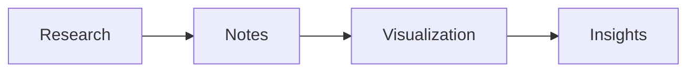

# TMapp - Secure Note-Taking Application

<div align="center">


**A privacy-first, extensible knowledge management platform with end-to-end encryption**

[](https://www.python.org/)
[](https://www.riverbankcomputing.com/software/pyqt/)
[](LICENSE)
[]()

[Features](#-key-features) • [Installation](#-installation) • [Usage](#-usage) • [Security](#-security) • [Documentation](#-documentation) • [Contributing](#-contributing)

</div>

---

## 🎯 Overview

**TMapp** is a professional-grade, **privacy-first note-taking application** designed for users who demand both security and functionality. Unlike traditional note-taking software, TMapp prioritizes:

- 🔐 **End-to-end encryption** - Your notes are encrypted locally before storage
- 🏠 **Local-first architecture** - No cloud dependency, your data stays on your device
- 🔗 **Structured knowledge linking** - Connect ideas with internal note references
- 📊 **Advanced visualization** - Embed charts, diagrams, and graphs directly in notes
- 🎨 **Modern UI/UX** - Professional dark/light themes with intuitive design

Perfect for **personal knowledge management**, **secure research documentation**, **technical project planning**, and **sensitive information storage**.

---

## ✨ Key Features

### 🔒 Security & Privacy

- **AES-256-GCM Encryption** - Military-grade encryption for all note content
- **Argon2id Key Derivation** - Resistant to brute-force and side-channel attacks
- **Master Password Protection** - Single password to unlock your entire vault
- **Zero-Knowledge Architecture** - No telemetry, no cloud sync, complete privacy
- **Secure Memory Handling** - Automatic key clearing and secure deletion
- **Auto-Lock Mechanism** - Configurable timeout for automatic vault locking
- **Account Lockout Protection** - Prevents brute-force password attempts

### 📝 Rich Note Editing

- **Hybrid Markdown + Rich Text Editor** - Best of both worlds
- **Syntax Highlighting** - Code blocks with language-specific highlighting
- **Real-time Auto-Save** - Never lose your work (saves every 2 seconds)
- **Internal Note Linking** - Create connections between related notes
- **Embedded Media Support** - Images, files, and attachments
- **Formatting Toolbar** - Bold, italic, underline, and more
- **Word Count & Statistics** - Track your writing progress

### 📊 Visualization & Diagrams

Embed visual elements directly inside your notes:

- **Mermaid Diagrams** - Flowcharts, sequence diagrams, and more
- **Chart.js Visualizations** - Bar charts, line graphs, pie charts
- **Knowledge Graphs** - Visualize connections between notes
- **LaTeX Math Rendering** - Beautiful mathematical formulas
- **Tables & Data Blocks** - Structured data presentation

**Example Mermaid Diagram:**
```markdown

```

**Example Chart:**
```markdown
```chart
type: bar
labels: [Jan, Feb, Mar]
data: [30, 45, 60]
```
```

### 🗂️ Organization & Management

- **Notebooks** - Organize notes into logical collections
- **Tags & Metadata** - Flexible categorization system
- **Favorites & Pinning** - Quick access to important notes
- **Archive System** - Hide notes without deleting them
- **Trash & Recovery** - Soft delete with restore capability
- **Full-Text Search** - Find notes instantly across your entire vault
- **Fuzzy Matching** - Smart search that understands typos

### 🎨 User Experience

- **Professional Dark/Light Themes** - Easy on the eyes, day or night
- **3-Panel Layout** - Sidebar, note list, and editor for efficient workflow
- **Keyboard Shortcuts** - Power-user friendly navigation
- **Context Menus** - Right-click for quick actions
- **Responsive Design** - Adapts to different screen sizes
- **Status Indicators** - Always know your save and encryption status

---

## 🚀 Installation

### Prerequisites

- **Python 3.8 or higher**
- **pip** (Python package manager)
- **Windows, macOS, or Linux**

### Quick Start

1. **Clone the repository:**
   ```bash
   git clone https://github.com/yourusername/TMapp.git
   cd TMapp
   ```

2. **Install dependencies:**
   ```bash
   pip install -r requirements.txt
   ```

3. **Run the application:**
   ```bash
   python src/main.py
   ```

### First-Time Setup

On first launch, you'll be guided through a setup wizard:

1. **Create Master Password** - Choose a strong, memorable password
2. **Password Requirements:**
   - Minimum 12 characters
   - At least one uppercase letter
   - At least one lowercase letter
   - At least one digit
   - At least one special character
3. **Store Safely** - ⚠️ If you forget your password, your notes cannot be recovered!

---

## 📖 Usage

### Basic Workflow

1. **Launch TMapp** - Enter your master password
2. **Create a Note** - Click "New Note" or press `Ctrl+N`
3. **Write Content** - Use the rich text editor with Markdown support
4. **Auto-Save** - Your changes are saved automatically every 2 seconds
5. **Organize** - Add to notebooks, tag, favorite, or pin important notes
6. **Search** - Use the search bar to find notes instantly
7. **Lock** - Press `Ctrl+L` to lock the application when stepping away

### Keyboard Shortcuts

| Shortcut | Action |
|----------|--------|
| `Ctrl+N` | Create new note |
| `Ctrl+S` | Manual save (auto-save is always active) |
| `Ctrl+L` | Lock application |
| `Ctrl+T` | Toggle dark/light theme |
| `Ctrl+F` | Focus search box |
| `Ctrl+Q` | Quit application |
| `Ctrl+B` | Bold text |
| `Ctrl+I` | Italic text |
| `Ctrl+U` | Underline text |

### Context Menu Actions

**Right-click on any note** to access:
- Add/Remove from Favorites
- Pin/Unpin note
- Move to Trash
- Restore from Trash
- Delete Permanently

### Managing Notes

#### Creating Notes
```python
# Notes are automatically encrypted before storage
# Simply type in the editor and changes are saved automatically
```

#### Organizing with Notebooks
- Create notebooks to group related notes
- Drag notes between notebooks
- Each notebook shows note count

#### Trash & Recovery
- Deleted notes go to Trash (soft delete)
- Restore notes from Trash anytime
- Empty Trash to permanently delete all trashed notes

---

## 🔐 Security

### Encryption Details

**TMapp uses industry-standard cryptography:**

- **Algorithm:** AES-256-GCM (Galois/Counter Mode)
- **Key Derivation:** Argon2id with configurable parameters
  - Time cost: 3 iterations
  - Memory cost: 100 MB
  - Parallelism: 4 threads
- **Salt:** 16-byte random salt per vault
- **Nonce:** 12-byte random nonce per encryption operation
- **Authentication:** 16-byte authentication tag (GCM)

### Security Model

**Zero-Trust Local Storage:**
- All note content is encrypted before writing to disk
- Master password never stored (only salt is stored)
- Encryption keys exist only in memory during active session
- Keys are securely cleared on lock/exit

**Threat Protection:**
- ✅ Unauthorized disk access
- ✅ Malicious file tampering (integrity verification)
- ✅ Brute force password attempts (account lockout)
- ✅ Memory dumps (keys cleared on lock)
- ✅ Side-channel attacks (Argon2id resistance)

### Best Practices

1. **Use a Strong Master Password**
   - Minimum 16 characters recommended
   - Use a passphrase with multiple words
   - Consider using a password manager

2. **Regular Backups**
   - Backup your vault regularly
   - Store backups in encrypted containers
   - Test restore procedures

3. **Physical Security**
   - Lock your computer when away
   - Enable auto-lock in TMapp settings
   - Use full-disk encryption on your device

4. **Password Recovery**
   - ⚠️ **There is NO password recovery mechanism**
   - This is by design for security
   - Store your password in a secure location

---

## 🏗️ Architecture

### Project Structure

```
TMapp/
├── src/
│   ├── core/              # Core functionality
│   │   ├── auth_manager.py      # Authentication & password management
│   │   ├── config.py            # Application configuration
│   │   ├── database.py          # SQLite database wrapper
│   │   └── encryption.py        # AES-256-GCM encryption service
│   ├── controllers/       # Business logic
│   │   ├── note_controller.py   # Note CRUD operations
│   │   └── notebook_controller.py # Notebook management
│   ├── models/            # Data models
│   │   ├── note.py              # Note entity
│   │   └── notebook.py          # Notebook entity
│   ├── ui/                # User interface
│   │   ├── main_window.py       # Main application window
│   │   ├── auth_dialog.py       # Authentication dialog
│   │   ├── first_run_wizard.py  # Setup wizard
│   │   └── theme_manager.py     # Theme system
│   ├── utils/             # Utilities
│   │   ├── backup_manager.py    # Backup/restore functionality
│   │   └── migration.py         # Database migrations
│   ├── app.py             # Application entry point
│   └── main.py            # Main launcher
├── tests/                 # Unit tests
├── docs/                  # Documentation
├── requirements.txt       # Python dependencies
├── reset_db.bat          # Database reset utility (Windows)
├── delete_database.py    # Database deletion script
└── README.md             # This file
```

### Technology Stack

- **Language:** Python 3.8+
- **GUI Framework:** PyQt6
- **Database:** SQLite3 with encryption
- **Cryptography:** `cryptography` library (AES-256-GCM, Argon2id)
- **Styling:** QSS (Qt Style Sheets)

---

## 🛠️ Development

### Setting Up Development Environment

1. **Clone and install:**
   ```bash
   git clone https://github.com/yourusername/TMapp.git
   cd TMapp
   pip install -r requirements.txt
   ```

2. **Run in development mode:**
   ```bash
   python src/main.py
   ```

3. **Run tests:**
   ```bash
   pytest tests/
   ```

### Database Reset (Development)

If you need to reset the database:

**Option 1: Simple Script**
```bash
python clear_db.py
```

**Option 2: Application Menu**
- File → Clear All Notes...
- Type "DELETE ALL" to confirm

### Contributing

We welcome contributions! Please follow these guidelines:

1. **Fork the repository**
2. **Create a feature branch:** `git checkout -b feature/amazing-feature`
3. **Commit your changes:** `git commit -m 'Add amazing feature'`
4. **Push to branch:** `git push origin feature/amazing-feature`
5. **Open a Pull Request**

**Code Standards:**
- Follow PEP 8 style guide
- Add docstrings to all functions/classes
- Write unit tests for new features
- Update documentation as needed

---

## 🧪 Testing

### Test Coverage

- **Unit Tests:** Core encryption, authentication, database operations
- **Security Tests:** Encryption integrity, authentication bypass attempts
- **Integration Tests:** Editor rendering, vault lifecycle, UI workflows

### Running Tests

```bash
# Run all tests
pytest

# Run with coverage
pytest --cov=src tests/

# Run specific test file
pytest tests/test_encryption.py
```

---

## 📚 Documentation

### Additional Resources

- **[Security Model](docs/SECURITY.md)** - Detailed security architecture
- **[API Documentation](docs/API.md)** - Developer API reference
- **[User Guide](docs/USER_GUIDE.md)** - Comprehensive user manual
- **[Database Reset Guide](DATABASE_RESET.md)** - Troubleshooting encryption issues

### Configuration

Configuration file location:
- **Windows:** `C:\Users\<username>\.tmapp\config.json`
- **macOS:** `~/Library/Application Support/TMapp/config.json`
- **Linux:** `~/.config/tmapp/config.json`

**Configurable Options:**
```json
{
  "theme": "dark",
  "auto_lock_timeout": 300,
  "auto_backup_enabled": true,
  "backup_interval": 3600,
  "editor_font_size": 16
}
```

---

## 🗺️ Roadmap

### Planned Features

- [ ] **Collaborative Encrypted Workspaces** - Share notes securely
- [ ] **Real-time Editing** - Collaborative editing with conflict resolution
- [ ] **AI-Assisted Summarization** - Automatic note summaries
- [ ] **Secure Cloud Sync** - End-to-end encrypted cloud backup
- [ ] **Mobile Companion Apps** - iOS and Android clients
- [ ] **Graph-Based Research Navigation** - Visual knowledge exploration
- [ ] **Plugin System** - Extensible architecture for custom features
- [ ] **Export Formats** - PDF, HTML, Markdown export
- [ ] **Import Tools** - Import from Evernote, Notion, OneNote
- [ ] **Version History** - Track note changes over time
- [ ] **Attachment Encryption** - Encrypt embedded files
- [ ] **Hardware Key Support** - YubiKey integration

### Version History

**v1.0.0** (Current)
- ✅ Core encryption engine
- ✅ Rich text editor
- ✅ Notebook organization
- ✅ Search functionality
- ✅ Dark/light themes
- ✅ Auto-save & auto-lock
- ✅ Trash & recovery

---

## ❓ FAQ

### General Questions

**Q: Is TMapp free?**
A: Yes, TMapp is open-source and free to use under the MIT License.

**Q: Does TMapp sync to the cloud?**
A: No, TMapp is local-first. Your notes stay on your device. Cloud sync is planned for future releases with end-to-end encryption.

**Q: Can I export my notes?**
A: Export functionality is planned for a future release. Currently, notes are stored in an encrypted SQLite database.

**Q: What happens if I forget my password?**
A: Unfortunately, there is no password recovery. This is by design for security. Your notes cannot be decrypted without the master password.

### Technical Questions

**Q: How secure is the encryption?**
A: TMapp uses AES-256-GCM with Argon2id key derivation, which are industry-standard, military-grade encryption algorithms.

**Q: Where are my notes stored?**
A: Notes are stored in an encrypted SQLite database at:
- Windows: `C:\Users\<username>\.tmapp\notes.db`
- macOS: `~/Library/Application Support/TMapp/notes.db`
- Linux: `~/.config/tmapp/notes.db`

**Q: Can I use TMapp on multiple devices?**
A: Currently, each installation is independent. Multi-device sync is planned for future releases.

**Q: How do I backup my notes?**
A: TMapp automatically creates backups. You can also manually copy the `notes.db` file to a secure location.

---

## 🐛 Troubleshooting

### Common Issues

**Issue: "Decryption failed" errors**
- **Cause:** Database contains notes encrypted with different salts (development issue)
- **Solution:** Reset the database using `reset_db.bat` or see [DATABASE_RESET.md](DATABASE_RESET.md)

**Issue: Application won't start**
- **Check:** Python version (3.8+ required)
- **Check:** All dependencies installed (`pip install -r requirements.txt`)
- **Check:** No conflicting PyQt installations

**Issue: Forgot master password**
- **Unfortunately:** There is no password recovery
- **Prevention:** Store password in a secure password manager

**Issue: Notes not saving**
- **Check:** Disk space available
- **Check:** Write permissions for application directory
- **Check:** Application logs for errors

### Getting Help

- **GitHub Issues:** [Report bugs or request features](https://github.com/yourusername/TMapp/issues)
- **Discussions:** [Ask questions and share ideas](https://github.com/yourusername/TMapp/discussions)
- **Email:** support@tmapp.example.com

---

## 📄 License

This project is licensed under the **MIT License** - see the [LICENSE](LICENSE) file for details.

```
MIT License

Copyright (c) 2024 TMapp Contributors

Permission is hereby granted, free of charge, to any person obtaining a copy
of this software and associated documentation files (the "Software"), to deal
in the Software without restriction, including without limitation the rights
to use, copy, modify, merge, publish, distribute, sublicense, and/or sell
copies of the Software, and to permit persons to whom the Software is
furnished to do so, subject to the following conditions:

The above copyright notice and this permission notice shall be included in all
copies or substantial portions of the Software.

THE SOFTWARE IS PROVIDED "AS IS", WITHOUT WARRANTY OF ANY KIND, EXPRESS OR
IMPLIED, INCLUDING BUT NOT LIMITED TO THE WARRANTIES OF MERCHANTABILITY,
FITNESS FOR A PARTICULAR PURPOSE AND NONINFRINGEMENT. IN NO EVENT SHALL THE
AUTHORS OR COPYRIGHT HOLDERS BE LIABLE FOR ANY CLAIM, DAMAGES OR OTHER
LIABILITY, WHETHER IN AN ACTION OF CONTRACT, TORT OR OTHERWISE, ARISING FROM,
OUT OF OR IN CONNECTION WITH THE SOFTWARE OR THE USE OR OTHER DEALINGS IN THE
SOFTWARE.
```

---

## 🙏 Acknowledgments

- **PyQt6** - Excellent Python GUI framework
- **cryptography** - Robust cryptographic library
- **Argon2** - Password hashing competition winner
- **AES-GCM** - NIST-approved encryption standard
- **Open Source Community** - For inspiration and support

---

## 📞 Contact

- **Project Maintainer:** Your Name
- **Email:** your.email@example.com
- **GitHub:** [@yourusername](https://github.com/yourusername)
- **Website:** [https://tmapp.example.com](https://tmapp.example.com)

---

<div align="center">

**Made with ❤️ and 🔐 by the TMapp Team**

[⬆ Back to Top](#tmapp---secure-note-taking-application)

</div>
